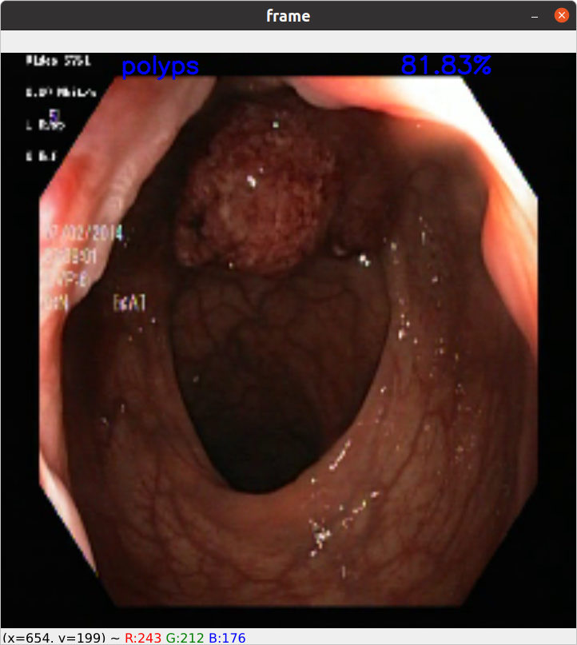

# Classification of endoscopic images

Scripts for training and testing convolutional neural network for endoscopic images classifying.

This script builds models from the library data "https://github.com/qubvel/classification_models" and 
"https://github.com/qubvel/efficientnet". Using these libraries allowed you to quickly test different models and 
choose the best option.

You can view or set parameters in config.py

Images are classified into nine categories. The dataset consists of 8431 images.
* cecum (1004 images)
* dyed-lifted-polyps (997 images)
* dyed-resection-margins (984 images)
* retroflex-stomach
* bbps-2-3 (1143 images)
* polyps (1023 images)
* z-line (927 images)
* bbps-0-1 (641 images) 
* pylorus (759 images)


## 1. Dataset preparation
My dataset has this configuration:
```
data/
    images/
        bbps-0-1/
            bbps_0_1_1.jpg
            bbps_0_1_2.jpg
            ...
        bbps-2-3/
        ...
        cecum/
        ...
    data.json
    index_class.json
```
Run this script to prepare dataset for training and testing:
```shell script
python create_json_file.py
```
## 2. Training
Run training script with default parameters:
```shell script
python train.py
```
## 3. Plotting graphs
If you want to build graphs from the saved logs, you can use graphics.py, passing the path to the json file to --logs.
```shell script
python graphics.py --logs path/to/logs.json
```
## 4. Testing
You can test the model on a video file.
For visualization, you need to pass two arguments "--weights " and "--path_video". A prediction of the model will be 
output for each frame of the video.
```shell script
python test_on_video --weights models_data/save_models/EfficientNetB0_imagenet_2021-05-18_15-26-13_False/EfficientNetB0.h5  --path_video test_video/vid_2.avi
```
The frame from the real test is shown below.
 


## Results
### EfficientNetB0
The graphs show metrics during model training without loaded "imagenet" weights.
Prediction examples:


The graphs show metrics during model training with loaded "imagenet" weights.
Prediction examples:


I used the resulting model with the following parameters.
``` 
loss           |  0.0053 
accuracy       |  0.9976 
recall         |  0.9721 
precision      |  0.9719 
F1_score       |  0.9716 
val_loss       |  0.0897 
val_accuracy   |  0.9618 
val_recall:    |  0.9481 
val_precision  |  0.9453 
val_F1_score   |  0.9432
```